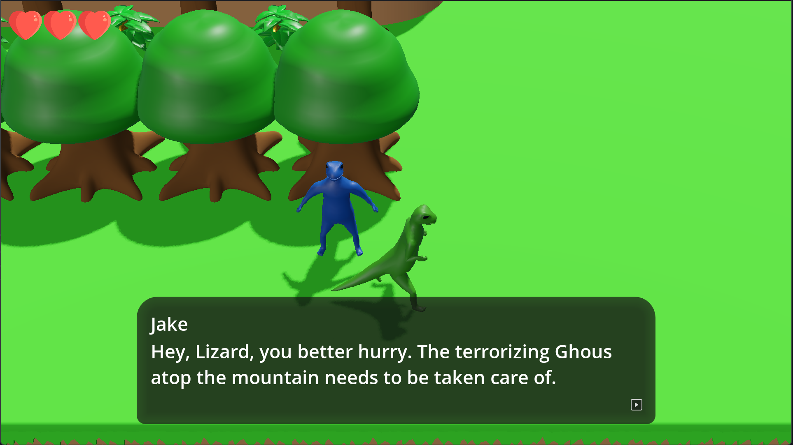
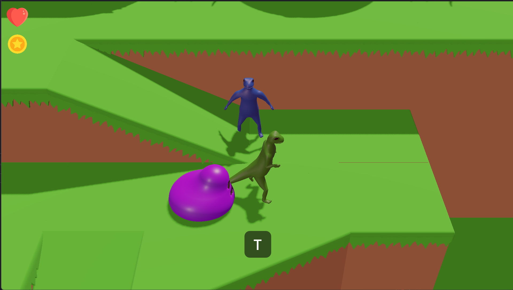

# BIP WIP Project
This project was made during BIP - "3D Modeling for Games" on Kaunas University of Technology in Lithunia. The course focused on 3D Modelling and video game development in game engine Godot.

## What we have done
Simple adventure game inspired by the Zelda videogames. Main character is a lizard and he can freely run around the world, collect coins, hearts, combat with enemies and talk with NPCs.

## Screenshots

Image 1: First interaction in the game is NPC explaining the story

Image 2: Lizard under attack by a purple ghoul.

## Authors
Jakub Jeřábek\
Matěj Čapek\
Kim Olsson